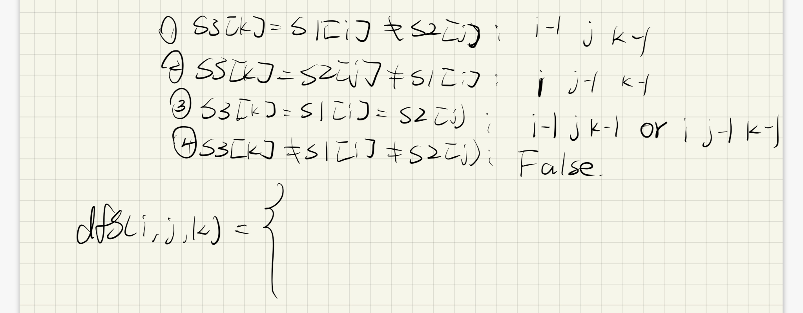

[97. Interleaving String](https://leetcode.com/problems/interleaving-string/)



```py
class Solution:
    def isInterleave(self, s1: str, s2: str, s3: str) -> bool:
        n1 = len(s1)
        n2 = len(s2)
        n3 = len(s3)

        @cache
        def dfs(i, j, k):
            if k >= n3:
                return True if i >= n1 and j>=n2 else False
            if i >= n1 and j>=n2 and k<n3:
                return False
            
            c1 = s1[i] if i < n1 else ''
            c2 = s2[j] if j < n2 else ''
            c3 = s3[k]
            
            if c3 == c1 and c3 != c2:
                return dfs(i+1, j, k+1)
            if c3 == c2 and c3 != c1:
                return dfs(i, j+1, k+1)
            if c3 == c2 == c1:
                return dfs(i+1, j, k+1) or dfs(i, j+1, k+1)
            if c3 != c2 and c3 != c1:
                return False
        
        return dfs(0, 0, 0)
```

